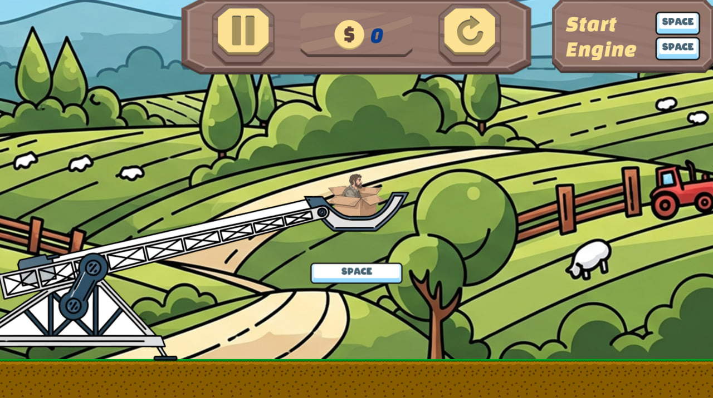
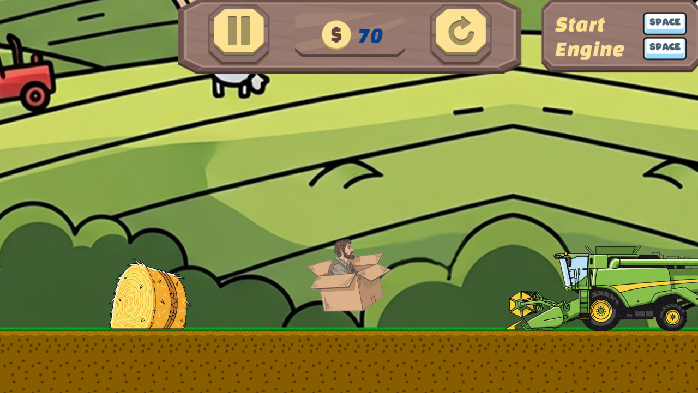
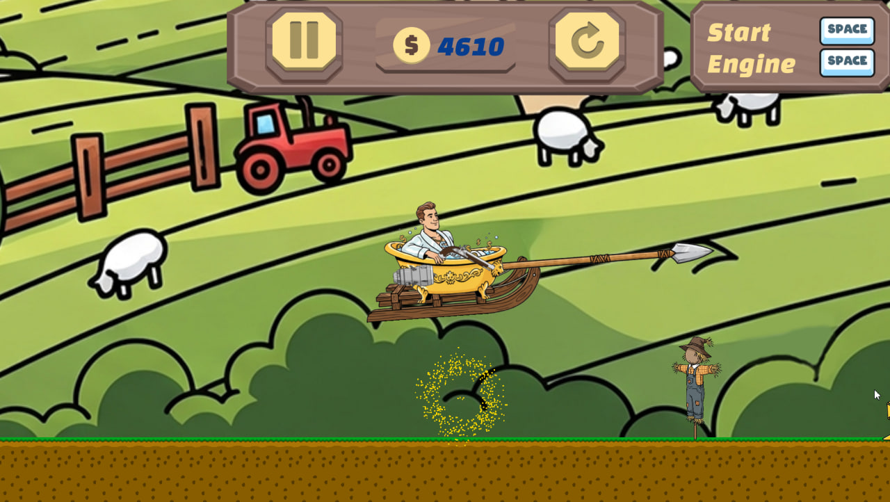
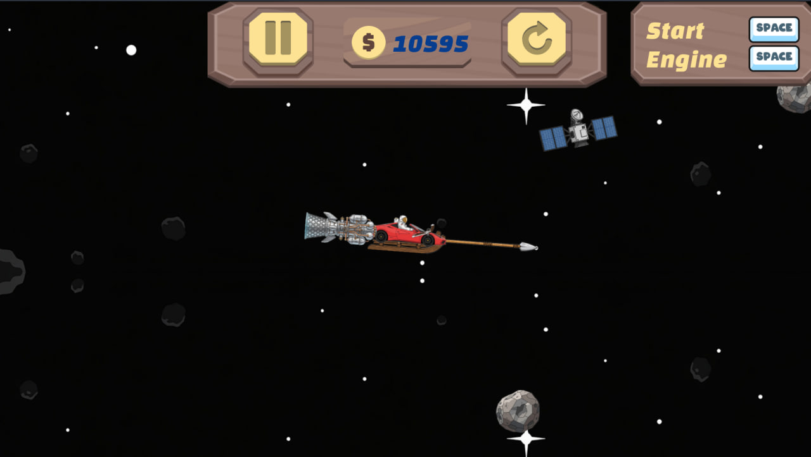

# Exiting Poverty game description

This repository, in the main branch, presents my first game.

This is a casual 2D game with a focus on upgrade mechanics. There are 5 types of upgrades:
- General
- Engine
- Gun
- Gear
- Melee weapon

Each upgrade has 4 levels. During a round, the player flies, destroys creatures and objects, receives score for this, and buys upgrades with these score.

Implemented:
- A prototype of the State pattern for player control;
- The EventBus pattern for communication between NPCs and the player's score;
- The Singleton pattern for global managers (UIManager, PlayerManager, etc.);
- The Observer pattern in the form of Godot signals (for communication between singletons and NPC objects).

Screenshots from the game:

